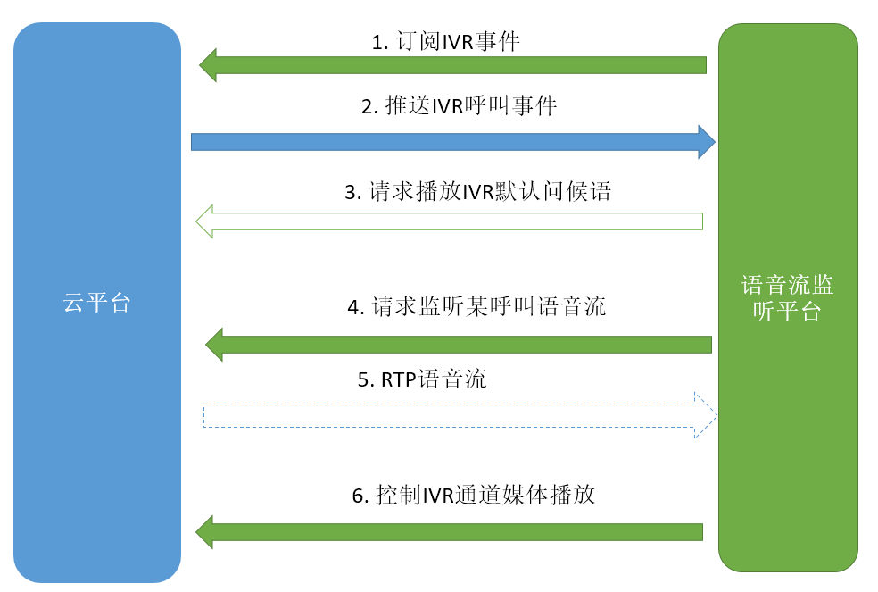

# 1 概述
 WellCloud云IVR集成主要是通过订阅IVR事件，在收到呼叫进入IVR事件(IvrStartedEvent)后开始请求接收该呼叫的语音流，通过分析客户的语音信息来判断接下来需要播放的内容及操作。
 
 
  IVR呼叫集成大体上可以分为以下几步：

1.  订阅IVR设备呼叫事件（云平台提供订阅接口，第三方系统调用订阅IVR设备呼叫事件）
2.	推送呼叫事件 （云平台把IVR呼叫事件数据推送到第三方系统提供的回调接口）
3.	播放IVR默认问候语 （当收到呼叫进入IVR后播放默认的问候语，这一步也可以省略）
4.	发起语音监听请求（云平台提供语音监听接口，第三方系统调用接口）
4.	语音流RTP发送 （云平台把RTP语音流发送监听请求指定的地址）
5.	控制IVR通道媒体 （云平台提供控制IVR通道媒体接口，第三方系统调用接口)


# 2 系统集成流程图

 


# 3 订阅事件接口
事件订阅接口请参考 [事件订阅与推送文档](https://wellcloud-docs.github.io/open-api/#/event), 订阅IVR事件对应的topics为：event.ivr.{domain} .


# 4	语音监听接口
## 4.1 开启语音监听接口
### 4.1.1	**接口说明**
云平台在呼叫接通后收到语音监听请求会把语音流以RTP形式发送到请求提供的地址和端口
### 4.1.2	**调用地址**
*POST:* /remote/monitor-call
### 4.1.3	**请求参数**

参数名   | 约束  | 类型 |    格式(样例)     |     说明
---------|-------|------|-------------------|-----------------
id | 必须 |String | 2db75da6-388b-4e75-a74a-4cd8197a13b4 |唯一标识符，请求编号
token |必须|String| a8307aa5-bd11-4216-a6e2-5e5d6161aec4|用于第3方集成配置的验证
callId | 必须|String | 82327ef4-b608-4af2-ab69-9186eab1d663|	IvrStartedEvent中的呼叫CallID
sip-callId|必须|String | 6df4cb47970d1b824c8fa48219b10142@192.168.40.193|	Sip呼叫CallID
from-tag|必须|String | r69vX16tmZ7cQ|Sip呼叫from头域中tag的内容
to-tag|必须|String | 8d4b8235|Sip呼叫to头域中tag的内容
a-rtp|必须|String| udp://172.16.200.17:33121|接收RTP的地址, 呼叫IVR端的语音流
c-rtp|必须|String |udp://172.16.200.17:33122|接收RTP的地址，呼叫客户端的语音流


### 4.1.4	**请求示例**

```json
// general
POST /remote/monitor-call

// request headers
Authorization: a8307aa5-bd11-4216-a6e2-5e5d6161aec4
Content-Type: application/json;charset=utf-8

// request body
{
 "id": "2db75da6-388b-4e75-a74a-4cd8197a13b4",
 "callId": "82327ef4-b608-4af2-ab69-9186eab1d663",
 "sip-callId": "6df4cb47970d1b824c8fa48219b10142@192.168.40.193",
 "from-tag":  "r69vX16tmZ7cQ",
 "to-tag":     "8d4b8235",
 "a-rtp": "udp://172.16.200.17:33121",
 "c-rtp": "udp://172.16.200.17:33122",
 "deviceId": "80126@yanrui.cc"
}
```

### 4.1.5 **响应包体示例**
```json
    {
    	"id": "2db75da6-388b-4e75-a74a-4cd8197a13b4",
     "result": "success"
    }
```
-----------------------------------------------

# 5	IVR接口
## 5.1 开始放音接口
### 5.1.1 **接口说明**

 在通话中播放指定的语音媒体

### 5.1.2 **请求地址**

*POST:* callControl/media/playMedia

### 5.1.3 **请求参数**

  参数名  | 约束 |  类型  |    格式(样例)     |     说明
  --------| ----------| ---------| ------------------- |-----------------------
  token | 是 | String | a8307aa5-bd11-4216-a6e2-5e5d6161aec4 | 用于第3方集成配置的验证
  callId |   是     |    String  |   82327ef4-b608-4af2-ab69-9186eab1d663             |呼叫CallID
  urls | 是  | String | welcome.wav;bye.wav | 语音媒体文件路径，多个文件之间用";"分割

### 5.1.4	**请求示例**

```json
// general
POST /media/playMedia

// request headers
Authorization: a8307aa5-bd11-4216-a6e2-5e5d6161aec4
Content-Type: application/json;charset=utf-8

// request body
{
 "callId": "82327ef4-b608-4af2-ab69-9186eab1d663",
 "urls":"welcome.wav;bye.wav"
}
```

### 5.1.5 **返回结果**

```json
{
    "callId":"82327ef4-b608-4af2-ab69-9186eab1d663"
}
```

---------------------
## 5.2 停止播放媒体

### 5.2.1 **接口说明**

 停止正在播放的语音媒体，如果有多个媒体文件则后面的媒体全部取消。

### 5.2.2 **请求地址**

*POST:* callControl/media/stopMedia

### 5.2.3 **请求参数**

  参数名  | 是否必须 |  类型  |    格式(样例)     |     说明
  --------| ----------| ---------| ------------------- |-----------------------
  token | 是 | String  | a8307aa5-bd11-4216-a6e2-5e5d6161aec4 | 用于第3方集成配置的验证
  callId |   是     |    String  |   82327ef4-b608-4af2-ab69-9186eab1d663    |呼叫CallID

### 5.2.4	**请求示例**

```json
// general
POST /media/stopMedia

// request headers
Authorization: a8307aa5-bd11-4216-a6e2-5e5d6161aec4
Content-Type: application/json;charset=utf-8

// request body
{
 "callId": "82327ef4-b608-4af2-ab69-9186eab1d663"
}
```

### 5.2.5 **返回结果**

```json
{
    "callId": "82327ef4-b608-4af2-ab69-9186eab1d663"
}
```

---------------------
## 5.3 停止并且播放新语音 

### 5.3.1 **接口说明**

 停止正在播放的语音媒体，如果有多个媒体文件则后面的媒体全部取消；开始播放新的语音媒体。

### 5.3.2 **请求地址**

*POST:* callControl/media/stopAndPlayMedia

### 5.3.3 **请求参数**

  参数名  | 是否必须 |  类型  |    格式(样例)     |     说明
  --------| ----------| ---------| ------------------- |-----------------------
  token  | 是    | String  | a8307aa5-bd11-4216-a6e2-5e5d6161aec4  | 用于第3方集成配置的验证
  callid |   是     |    String  |   82327ef4-b608-4af2-ab69-9186eab1d663     |呼叫CallID
  urls | 是  | String | welcome.wav;bye.wav | 语音媒体文件路径，多个文件之间用";"分割

### 5.3.4	**请求示例**

```json
// general
POST /media/stopAndPlayMedia

// request headers
Authorization: a8307aa5-bd11-4216-a6e2-5e5d6161aec4
Content-Type: application/json;charset=utf-8

// request body
{
 "callId": "82327ef4-b608-4af2-ab69-9186eab1d663",
 "urls": "welcome.wav;bye.wav"
}
```

### 5.3.5 **返回结果**

```json
{
    "callId":"82327ef4-b608-4af2-ab69-9186eab1d663"
}
```

-----------------------------------


# 6 全局返回码说明

调用接口时返回异常如下：


 返回码  | 描述 
  --------| ----------
  2       | 请求参数为空
  10000   | 服务端内部异常
  10001   | 设备格式不正确
  10002   | Call不存在
  10003   | 该接口暂时不支持
  10004   | 录音文件路径不存在
  10005   | 路由ID不存在
  10006   | CallMgr连接不可用
  10007   | 没有可用的SipServer


-------------------------

# 7 IVR呼叫事件

## IVR开始事件 (IvrStartedEvent)

字段名  |  类型  |    格式(样例)     |     说明
--------| ---------| ---------------- |-----------------------
eventName | String | IvrStartedEvent | 事件名称
eventSrc  | String | 6001@test.cc | 事件源
eventTime | Date   | 2018.06.12 11:33:56 | 事件时间戳
serial    | int    | 10           | 事件序列号,值递增
namespace | String | test.cc      | 命名空间
srcDeviceId | String | 6001@test.cc | 事件源设备
callId    | String  | a8307aa5-bd11-4216-a6e2-5e5d6161aec4 | 呼叫ID
deviceId  | String  | 6001@test.cc  | 状态发送变化的设备
connectionId | String | a8307aa5-bd11-4216-a6e2-5e5d6161aec4 | 呼叫一方的ConnID
callingDevice | String | 18012345678@test.cc | 主叫号码
calledDevice  | String | 6001@test.cc | 被叫号码
localConnectionState | String | Connect | 呼叫方的Connection状态
cause | String | IVR | 呼叫状态变化原因
sipCallId | String | 1eec781e-e7fe-1236-1082-005056950ecd | SIP信令CallID
sipFromTag | String | U3Bcm8yp9aXXg  | SIP信令FromTag
sipToTag | String | 112b2501a0be4a688d5f3a91dee54b95 | SIP信令ToTag
topics | Set | ivr,call | 事件主题


-------------------------

## IVR结束事件 (IvrEndedEvent)

字段名  |  类型  |    格式(样例)     |     说明
--------| ---------| ---------------- |-----------------------
eventName | String | IvrEndedEvent | 事件名称
eventSrc  | String | 6001@test.cc | 事件源
eventTime | Date   | 2018.06.12 11:33:56 | 事件时间戳
serial    | int    | 10           | 事件序列号,值递增
namespace | String | test.cc      | 命名空间
srcDeviceId | String | 6001@test.cc | 事件源设备
callId    | String  | a8307aa5-bd11-4216-a6e2-5e5d6161aec4 | 呼叫ID
deviceId  | String  | 6001@test.cc  | 状态发送变化的设备
connectionId | String | a8307aa5-bd11-4216-a6e2-5e5d6161aec4 | 呼叫一方的ConnID
localConnectionState | String | Idle | 呼叫方的Connection状态
cause | String | NORMAL_CLEAR | 呼叫状态变化原因
topics | Set |ivr,call | 事件主题


-------------------------

